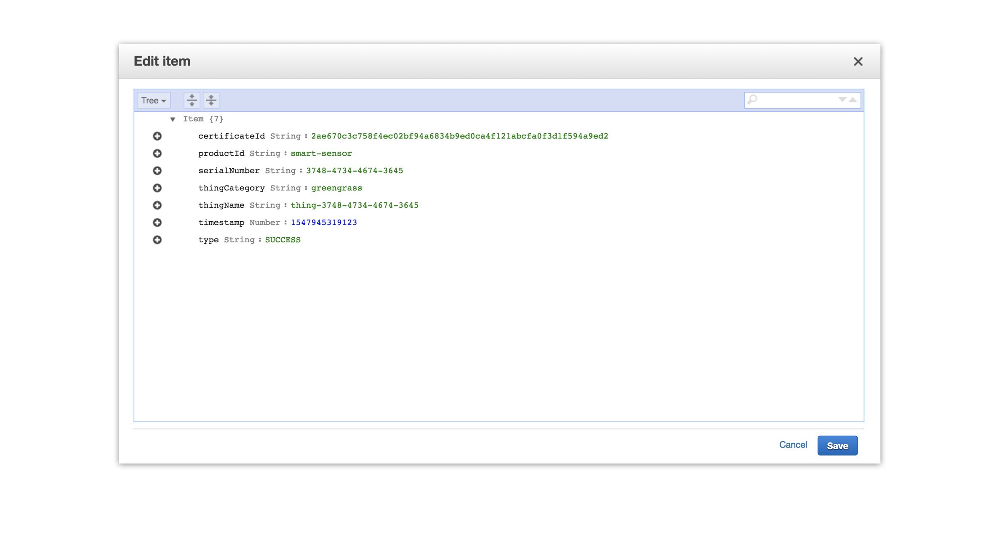
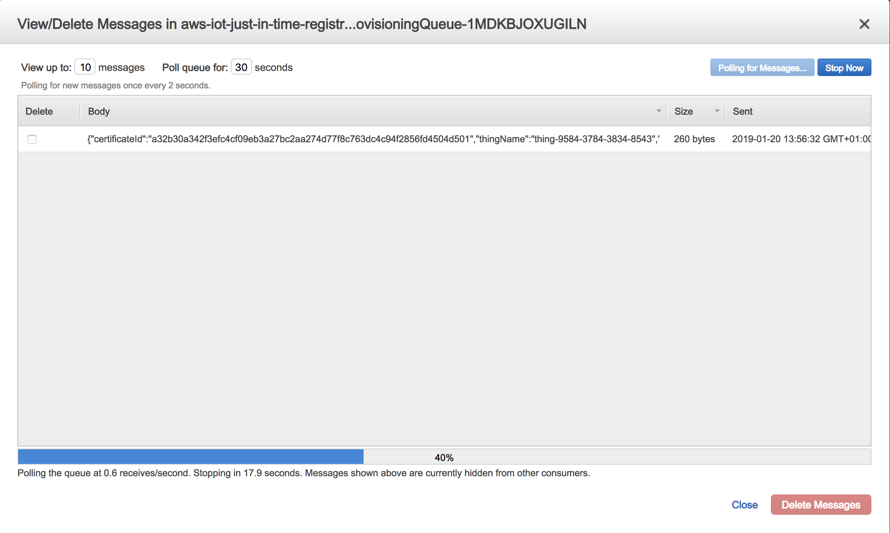

<br />
<p align="center">
  
</p>
<br />

# just-in-time-registration
> A universal implementation of the AWS JITR for IoT devices and AWS Greengrass.

[](contributing.md)
[](https://www.codefactor.io/repository/github/hqarroum/just-in-time-registration)

Current version: **1.0.0**

Lead Maintainer: [Halim Qarroum](mailto:hqm.post@gmail.com)

## Table of content

 - [Features](#features)
 - [Description](#description)
 - [Certificate fields](#certificate-fields)
 - [Pre-requisites](#pre-requisites)
 - [Deployment](#deployment)
 - [Command-line tools](#command-line-tools)
 - [See also](#see-also)
 
## Features

 - Universal Just-in-Time Registration implementation for Greengrass devices and IoT devices.
 - Allows dynamic parameterization of your thing related attributes given certificate fields.
 - Provides the tooling to create your custom Root CA and device certificates in an automated fashion.
 - Allows injection of implementer-provided Lambda function to validate the registration.

## Description

The Universal [Just In Time Registration (JITR)](https://aws.amazon.com/fr/blogs/iot/just-in-time-registration-of-device-certificates-on-aws-iot/) process is a reference implementation of the JITR for the AWS platform that supports auto-registration of IoT and AWS Greengrass devices connecting themselves directly to AWS IoT Core using X.509 certficates.

The JITR process requires usage and registration of a [Root Certificate of Authority (Root CA)](https://en.wikipedia.org/wiki/Root_certificate) maintained by the owner or manufacturer of a device which allows them to issue certificates without involving the AWS IoT service (an example would be mass provisionning of devices within a factory before shipping). The AWS IoT service is then able to invoke a lambda function each time a non-registered certificate associated with the registered CA connects to the AWS IoT platform.

This implementation is *certificate-centric* in that it allows device owners the freedom to define specific attributes in their certificates in order to customize the provisionning process on AWS IoT. Since certificates are signed with your Root CA, and it is registered on AWS IoT, embedded fields are considered authentic and non-repudiable.
The universal JITR lambda function takes the following actions when a new device connects to the platform :

 - It validates the certificate fields (see the [Certificate fields](#certificate-fields) section for more information on required fields). If the fields are incorrect, the registration process is aborted.
 - It optionally calls an external implementer-provided Lambda function which can be served as a callback to define whether to continue the registration process or not. This can come in handy when implementers maintain a [Certificate Revocation List (CRL)](https://en.wikipedia.org/wiki/Certificate_revocation_list) for instance, but can be used for any purpose really.
 - It creates a thing associated with the new device which will be provisioned with its certificates attributes in the AWS IoT device registry.
 - It associates the created thing with a defined thing type.
 - It creates a new IoT policy associated with the thing.
 - It associates the created policy with the new thing.
 - It creates the certificate in the AWS IoT certificate registry and activates it.
 
 > Note that the activation of the certificate is the latest step to be executed in order to guarantee that when a device suceeds to connect, every resources is already available on the account.

 ## Certificate fields
 
 You can embed any standard field into your X.509 certificates, but to enforce consistency and create appropriate semantics across a fleet, this implementation requires you to provide the following fields in the device certificate :
 
  - **serialNumber** - Allows to uniquely address your device on the platform (used in our AWS IoT policy to enforce the device permissions on the platform).
  - **title** - Identifies the type of the device, supported values are `greengrass` to identify Greengrass devices or `iot` to identify a regular IoT device. This field will be used to determine whether the invoked Lambda function should create a Greengrass Group in addition to the thing in the AWS IoT device registry.
  - **generationQualifier** - The product identifier associated with the created thing. This will associate the created thing with a `product-id` attribute having this field as value.
 
> These required attributes will be associated to the created `Thing` in the AWS IoT device registry as searchable attributes. All the other certificate attributes contained in the certificate will be associated with non-searchable attributes on the created `Thing` object. Note that you can embed up to **50** attributes in your certificate, comprising the mandatory fields.

 ## Pre-requisites

A few components are required as dependencies to this project before using the scripts it contains :

  - The [openssl](https://wiki.openssl.org/index.php/Command_Line_Utilities) command-line tools should be installed on your operating system. These tools usually are already pre-installed on most Linux distributions, and on MacOS.
  - The [jq](https://stedolan.github.io/jq/) command-line tool enables the script to parse JSON documents and consume its content.
  - The [AWS CLI](https://aws.amazon.com/fr/cli/) must be installed and configured with at least one account.
  - The [mosquitto_pub](https://mosquitto.org/man/mosquitto_pub-1.html) command-line tools to test your generated certificates.

## Deployment

To deploy this template on your account, simply click on the *Launch Stack* quick-link we provide down below (the template will be deployed in the *us-east-1* region by default, to change this setting, simply change your region in the top-right hand corner of the console after clicking the link).

[](https://console.aws.amazon.com/cloudformation/home?region=us-east-1#/stacks/new?stackName=aws-iot-just-in-time-registration&templateURL=https://github.com/HQarroum/just-in-time-registration/blob/master/cloudformation/cloudformation.yml)

### Parameterization

For the sake of genericity, the template provides you with the ability to inject parameters before deploying the stack in the *Parameters* step of the CloudFormation deployment wizard.

The **PolicyName**, **ThingName**, **GreengrassGroupName** and the **ThingTypeName** parameters of the stack can be *parameterized* using variables at run-time dynamically. To insert parameters in the parameter, you must keep the variables between the following enclosure : `<%= my-variable %>`.

As such, if the certificate's subject fields contains the serial number of the device and you want it to be part of its thing name naming policy, you can set the `ThingName` parameter of the template to the following value :

```js
thing-<%= certificate.attributes.subject.serialNumber %>
```

Note that many standard X.509 fields are associated with acronyms rather than full names, for instance the *common name* of a subject field in the certificate will be addressable with the `CN` identifier :

```js
thing-<%= certificate.attributes.subject.CN %>
```

Similarly, the `generationQualifier` standard field associated with a device can be addressed using the `2.5.4.44` identifier as follow :

```js
thing-<%= certificate.attributes.subject['2.5.4.44'] %>
```

As of this version, the only variable accessible through the template is the `certificate` object which has the following schema :

```json
{
  "certificateDescription": {
    "certificateId": "The identifier of the certificate.",
    "certificateArn": "The Arn of the certificate.",
    "caCertificateId": "The certificate ID of the CA certificate used to sign this certificate.",
    "status": "The status of the certificate.",
    "certificatePem": "The certificate data, in PEM format.",
    "ownedBy": "The ID of the AWS account that owns the certificate.",
    "previousOwnedBy": "The ID of the AWS account of the previous owner of the certificate.",
    "creationDate": "The date and time the certificate was created.",
    "lastModifiedDate": "The date and time the certificate was last modified.",
    "transferData": "An associative object holding information relative to transfert data."
  },
  "awsAccountId": "The ID of the AWS account at the origin of the JITR message.",
  "attributes": {
    "subject": "Attributes associated with the certificate's subject field.",
    "issuer": "Attributes associated with the certificate's issuer field."
  }
}
```

### AWS services integration

In addition to automatically provisioning your device registry, this implementation allows you to optionally integrate with third-party AWS services such as DynamoDB and SQS in order to log each provisioning action, or to allow to you to further integrate it within your existing infrastructure. We will log success events and their associated properties, as well as failure events with the produced error to allow you to pinpoint issues while provisioning devices.

#### DynamoDB

While deploying the template, you can enable the **LogEventsToDynamo** parameter which will create a new DynamoDB on-demand table (in order to best respond to spike provisioning events without requiring that you provision reads and writes ahead of time) and have all the events being logged into this table.

<br /><br />
<p align="center">
  
</p>

If you want to further integrate these events with your data lake, you can create a DynamoDB stream associated with this table which will redirect them to an S3 bucket.

#### SQS

We also offer the ability to push the created provisioning events to an SQS queue which you can enable by toggling the **LogEventsToSqs** parameter of the Cloudformation template.

<br /><br />
<p align="center">
  
</p>

This can allow you to handle the messages as discrete transactions and integrate them with your internal messaging system to perform additional actions (e.g integrate the SQS queue with SNS and have a message sent to an HTTPS endpoint, etc.).

## Command-line tools

This project features two scripts in the `bin` directory :

  - [`create-and-register-ca.sh`](bin/create-and-register-ca.sh) starts the process of creating an X.509 Root Certificate of Authority and will, if you accept it, register the newly created Root CA on AWS IoT, activate it, and enable its auto registration status.
  - [`create-device-certificate.sh`](bin/create-device-certificate.sh) uses a previously created Root Certificate of Authority to sign a new device certificate which is ready to be provisionned on a device.

In order to be able to execute the above scripts, make sure that they are executable. On a Unix system, you can run `chmod +x <your_script>` in order to do so.

### Create and register a CA

The `create-and-register-ca.sh` script does not take mandatory arguments, but you can specify optional one:

  - **-c** - takes as an option the name of the resulting CA file. For example, `-c foo` will produce the `foo.key`, the `foo.pem` and the `foo.srl` files. Its default value is `my-ca-certificate`.
  - **-p** - takes as an option the name of the private key created as a result of the CSR associated with the registration code. Its default value is `private-key-registration`.
  - **-c** - takes as an option the path to the OpenSSL configuration file to use for the Certificate Authority. The default path is `./config/openssl-ca.conf`.

Once you run the script, it will generate all the keys required to produce and register the new CA. The script will prompt you whether you want to register the CA right away on AWS IoT after its creation.

A sample configuration file associated with the creation of the CA is located by default at `./bin/config/openssl-ca.conf`. In this file you can customize OpenSSL properties, and update the informations registered in the certificate (e.g `OrganizationName`, `Country`, `CommonName`, etc.).

### Create a device certificate

The `create-device-certificate.sh` script does not take mandatory arguments, but you can specify the following optional ones :

  - **-c** - takes as an option the name of the Certificate Authority used to sign the device certificate. Its default value is `my-ca-certificate`.
  - **-n** - takes as an option the name of the resulting device certificate. Its default value is `my-device-cerificate`.
  - **-r** - takes as an option the path of the reulting AWS Root certificate that will automatically be downloaded. Its default value is `aws-root-cert.pem`.
  - **-c** - takes as an option the path to the OpenSSL configuration file to use for the device certificate. The default path is `./config/openssl-device.conf`.

The script when run will create a new set of device certificates that will be ready to use to connect to AWS IoT. The script will automatically download the AWS Root certificate to allow you to test the connection right away.

> Take a look at the default configuration file to customize informations associated with the certificate before you generate one.

### Default IoT Policy

The default IoT policy in this implementation limits access to the device to AWS IoT using the following rules :

 - The device must connect with an MQTT client id equal to the serial number provided in its certificate.
 - The device is authorized to subscribe to `device/<serialNumber>` and `device/<serialNumber>/#`, where `serialNumber` is the device serial number as provided in its certificate.
 - The device is authorized to publish to `device/<serialNumber>` and `device/<serialNumber>/#`, where `serialNumber` is the device serial number as provided in its certificate.
 - The device has subscribe and publish access to its associated device shadow.
 
This generic policy has proven to be quite efficient and powerful across many type of architectures while being simple and guaranteeing an optimal level of segregation and security.

### Testing the certificates

Once you CA has been registered and your device certificate has been generated, you can test the connection to AWS IoT using the `mosquitto_pub` command-line tool.

```bash
mosquitto_pub --cafile aws-root-cert.pem --cert device-and-ca-certificate.crt --key my-device-cerificate.key -h <prefix>.iot.<region>.amazonaws.com -p 8883 -q 1 -t foo/bar -i  anyclientID --tls-version tlsv1.2 -m "Hello" -d
```

Note that your very first connection to AWS IoT will fail, since the JITR process is triggered on a first connection. Once the Lambda function is triggered and will have created and activated your device certificate in the AWS IoT registry, the connection will then succeed. 

### Working with multiple accounts

If you have registered multiple account credentilas into your AWS CLI's configuration, you can select on which account you'd want to deploy the CA by specifying an inline environment value :

```bash
AWS_PROFILE=my-profile ./create-and-register-ca.sh
```

## See Also

 - [ansible-greengrass](https://github.com/green-platform/ansible-greengrass) - An automated device provisioning for AWS Greengrass with Ansible.
